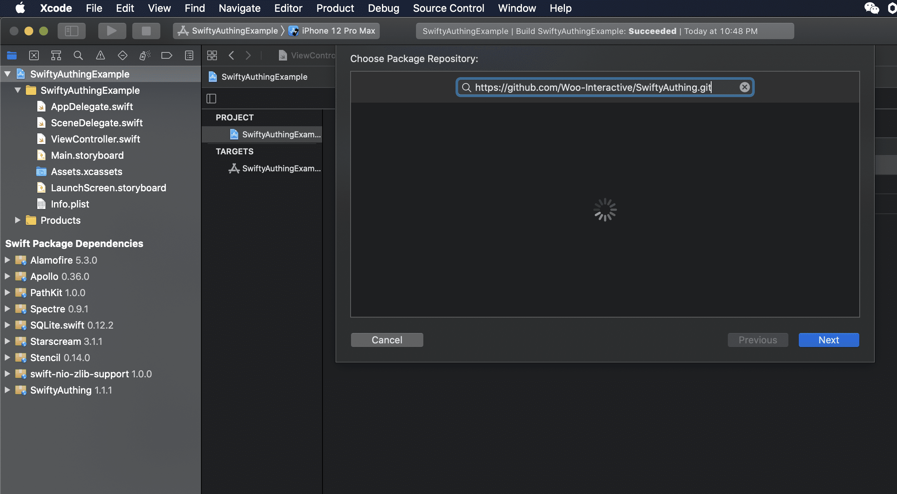

# SwiftyAuthing

**SwiftyAuthing** is a pure swift library for [Authing](https://authing.cn).


## Requirements

- Swift 5.0 +
- Xcode 11 +
- iOS 10+


## Installation

### Swift Package Manager

1. Xcode - Project - Swift Packages
2. Add + https://github.com/Woo-Interactive/SwiftyAuthing.git





## Example

1. Clone repository

2. Change **UserPoolId and Host** in SwiftyAuthingExample - ViewController.swift

3. Run **SwiftyAuthingExample** with iOS simulator or device.

4. Test and check data with web console [https://console.authing.cn](https://console.authing.cn)


## How to use

```
import SwiftyAuthing

    //Change your UserPoolId, Secret and Host in https://console.authing.cn Setting - Basic Information.
    let client: AuthenticationClient = AuthenticationClient(userPoolId: userPoolId, secret: secret, host: host)

    /// Init SDK and get AccessToken.
    ///
    func getClientWhenSdkInit() {
        self.client?.getClientWhenSdkInit(completion:{status in
            if(status.errors == nil) {
                //Success
                guard let result = status.data?.getClientWhenSdkInit else { return }
                print(result.accessToken ?? "")
                print(result)
            } else {
                //Failure
                print(status.errors ?? "")
            }
        })
    }
    
    /// Register by Username and Password.
    ///
    func registerByUsername() {
        self.client?.registerByUsername(username: textUsername.text!, password: textPassword.text!, completion:{status in
            if(status.errors == nil) {
                //Success
                print(status.data?.register ?? "")
            } else {
                //Failure
                print(status.errors ?? "")
            }
        })
    }
    
    /// Register by Email and Password.
    ///
    func registerByEmail() {
        self.client?.registerByEmail(email: textEmail.text!, password: textPassword.text!, completion: {status in
            if(status.errors == nil) {
                //Success
                print(status.data?.register ?? "")
            } else {
                //Failure
                print(status.errors ?? "")
            }
        })
    }
    
    
    /// Send Verify Email.
    ///
    func sendVerifyEmail() {
        self.client?.sendVerifyEmail(mail: textEmail.text!, completion: {status in
            if(status.errors == nil) {
                //Success
                print(status.data?.sendVerifyEmail ?? "")
            } else {
                //Failure
                print(status.errors ?? "")
            }
        })
    }
    
    
    /// Send SMS Code to Phone Number.
    ///
    func sendSmsCode() {
        self.client?.sendSmsCode(phone: textPhone.text!, completion: { status in
            print(status)
        })
    }
    
    /// Register by Phone Number and SMS Code.
    ///
    func registerByPhoneCode() {
        self.client?.registerByPhoneCode(phone: textPhone.text!, phoneCode: Int(textPhonecode.text!)!, completion:{ status in
            if(status.errors == nil) {
                //Success
                print(status.data?.login ?? "")
            } else {
                //Failure
                print(status.errors ?? "")
            }
        })
    }
    
    /// Login with Username and Password.
    ///
    func loginByUsername() {
        self.client?.loginByUsername(username: textUsername.text!, password: textPassword.text!, completion:{ status in
            if(status.errors == nil) {
                //Success
                print(status.data?.login ?? "")
            } else {
                //Failure
                print(status.errors ?? "")
            }
        })
    }
    
    /// Login by Email and Password.
    ///
    func loginByEmail() {
        self.client?.loginByEmail(email: textEmail.text!, password: textPassword.text!, completion:{ status in
            if(status.errors == nil) {
                //Success
                print(status.data?.login ?? "")
            } else {
                //Failure
                print(status.errors ?? "")
            }
        })
    }
    
    /// Login by Phone Number and SMS Code.
    ///
    func loginByPhoneCode() {
        self.client?.loginByPhoneCode(phone: textPhone.text!, phoneCode: Int(textPhonecode.text!)!, completion:{ status in
            if(status.errors == nil) {
                //Success
                print(status.data?.login ?? "")
            } else {
                //Failure
                print(status.errors ?? "")
            }
        })
    }
    
    /// Login by Phone Number and Password.
    ///
    func loginByPhonePassword() {
        self.client?.loginByPhonePassword(phone: textPhone.text!, password: textPassword.text!, completion:{ status in
            if(status.errors == nil) {
                //Success
                print(status.data?.login ?? "")
            } else {
                //Failure
                print(status.errors ?? "")
            }
        })
    }


```

